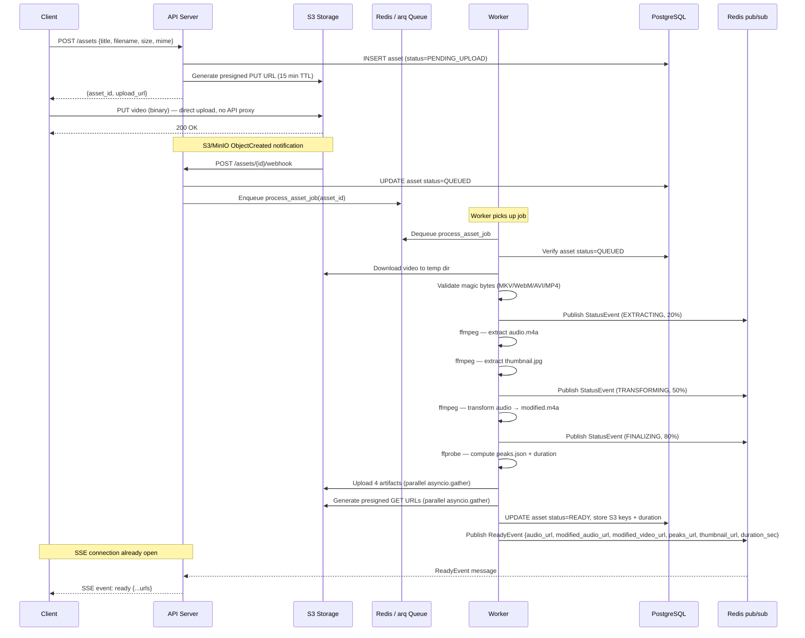

<h1 align="center">Video Audio Server</h1>

<p align="center">
  Async Python API that accepts video uploads, processes them into audio artifacts, and streams real-time progress to connected clients.
</p>

---

## Tech Stack

| Layer            | Technology                                  |
| ---------------- | ------------------------------------------- |
| Language         | Python 3.12                                 |
| Web framework    | FastAPI (async, ASGI)                       |
| Job queue        | arq (async Redis queue)                     |
| Cache / pub-sub  | Redis                                       |
| Object storage   | S3-compatible (aioboto3)                    |
| Video processing | FFmpeg / FFprobe                            |
| Authentication   | JWT (HS256) + bcrypt refresh-token rotation |
| Real-time events | Server-Sent Events over Redis pub/sub       |

<p align="left"><a href="#">↑ Back to top</a></p>

---

## Running locally

The server consists of two processes that must both be running for video processing to work end-to-end.

**1. Start infrastructure** (Postgres, Redis, MinIO):

```bash
npm run server:docker:up
```

**2. Start the API server** (in one terminal):

```bash
npm run server:start
```

**3. Start the arq worker** (in a second terminal):

```bash
npm run worker:start
```

The worker connects to the same Redis instance and picks up jobs enqueued by the S3 webhook. Without it, uploads will complete but assets will stay in `QUEUED` status and never be processed.

<p align="left"><a href="#">↑ Back to top</a></p>

---

## Table of Contents

- [Tech Stack](#tech-stack)
- [Running locally](#running-locally)
- [Table of Contents](#table-of-contents)
- [Upload \& processing flow](#upload--processing-flow)
    - [How it works](#how-it-works)
    - [S3 object layout per asset](#s3-object-layout-per-asset)
    - [Processing pipeline stages](#processing-pipeline-stages)
- [Authentication](#authentication)
    - [Token lifecycle](#token-lifecycle)
- [Real-time status events](#real-time-status-events)
- [Project structure](#project-structure)

<p align="left"><a href="#">↑ Back to top</a></p>

## Upload & processing flow

The server exposes two responsibilities that run as separate containers:

- **API** (`Dockerfile`) — handles HTTP traffic, issues presigned S3 URLs, serves SSE streams.
- **Worker** (`Dockerfile.worker`) — pulls jobs from the arq queue, processes video through the FFmpeg pipeline, and writes results back to S3 and Postgres.

### How it works

1. The client creates an asset record via `POST /assets` and receives a short-lived presigned S3 PUT URL.
2. The client uploads the video file **directly to S3**.
3. S3/MinIO fires an `ObjectCreated` bucket notification to `POST /assets/{id}/webhook`, which enqueues the processing job. The React client is not involved in this step.
4. A Worker dequeues the job and runs the pipeline. After each stage it publishes a `StatusEvent` to a Redis channel named `user:{user_id}`.
5. Any API replica that has an open SSE connection for that user forwards the event to the browser in real time.
6. On completion the Worker uploads four artifacts to S3, generates presigned GET URLs, and publishes a `ReadyEvent`.



### S3 object layout per asset

```
{user_id}/{asset_id}/
├── video.{ext}       — original upload
├── audio.m4a         — extracted audio
├── modified.m4a      — pitch/speed-adjusted audio
├── peaks.json        — waveform amplitude data
└── thumbnail.jpg     — video frame snapshot
```

### Processing pipeline stages

| Stage                                      | Status         | Progress |
| ------------------------------------------ | -------------- | -------- |
| Job enqueued                               | `QUEUED`       | 0%       |
| Downloading + extracting audio & thumbnail | `EXTRACTING`   | 20%      |
| Applying audio transformation              | `TRANSFORMING` | 50%      |
| Computing peaks + duration                 | `FINALIZING`   | 80%      |
| Uploading artifacts, generating URLs       | `READY`        | 100%     |

On any unhandled error the asset is set to `FAILED` and an `ErrorEvent` is published so the client can surface the failure immediately.

<p align="left"><a href="#">↑ Back to top</a></p>

---

## Authentication

All asset endpoints are scoped to the authenticated user. The server uses a two-token scheme:

- **Access token** — short-lived JWT (HS256, 15-minute expiry). The `jti` claim is stored in Redis so tokens can be revoked instantly without waiting for expiry.
- **Refresh token** — persisted in Postgres as a bcrypt hash, grouped by `family_id` for rotation tracking.

### Token lifecycle

```
Signup / Login
  └─ issue_token_pair()
       ├─ Access JWT  → jti stored in Redis (TTL 900 s)
       └─ RefreshToken record → Postgres (TTL 7 days)

Protected request
  └─ Bearer token → decode JWT → verify jti in Redis → load User

Refresh
  └─ validate refresh token hash
  └─ issue new token pair (same family_id)
  └─ old refresh token invalidated

Logout
  └─ refresh token revoked
  └─ jti deleted from Redis (access token immediately invalid)

Token reuse detected (replay attack)
  └─ entire family_id revoked → user forced to re-login
```

<p align="left"><a href="#">↑ Back to top</a></p>

---

## Real-time status events

Connect once after creating an asset and receive all status updates until the job completes:

```
GET /events?access_token=<jwt>
Content-Type: text/event-stream
```

The access token is passed as a query parameter because the `EventSource` browser API does not support custom headers.

Three event types are emitted:

| Event    | When                           | Payload                                                                                                 |
| -------- | ------------------------------ | ------------------------------------------------------------------------------------------------------- |
| `status` | Each pipeline stage transition | `{asset_id, state, progress}`                                                                           |
| `ready`  | Processing complete            | `{asset_id, audio_url, modified_audio_url, modified_video_url, peaks_url, thumbnail_url, duration_sec}` |
| `error`  | Processing failed              | `{asset_id, code, message}`                                                                             |

Events are broadcast over Redis pub/sub on channel `user:{user_id}`, so any horizontally scaled API replica can forward events to its connected clients.

<p align="left"><a href="#">↑ Back to top</a></p>

---

## Project structure

```
video_audio_server/
├── main.py          — app factory
├── worker.py        — arq entry point
│
├── core/            — infrastructure; no business logic; consumed by all modules
│   ├── config/      — environment settings
│   ├── db/          — async engine, session factory, migrations
│   ├── middlewares/ — request-level cross-cutting concerns
│   ├── models/      — shared error and response schemas
│   ├── decorators/  — reusable route decorators
│   └── services/    — infrastructure services (e.g. SSE pub/sub)
│
├── modules/         — feature modules, one per domain
│   ├── auth/
│   │   ├── controller    — HTTP routes
│   │   ├── service       — business logic
│   │   ├── models/       — request / response schemas
│   │   ├── entities/     — ORM models
│   │   └── repositories/ — data access
│   └── assets/
│       ├── controller    — HTTP routes
│       ├── service       — business logic
│       ├── models/       — request / response / SSE schemas
│       ├── entities/     — ORM models
│       ├── repositories/ — data access
│       ├── jobs/         — background job entry points
│       └── pipeline/     — processing steps (extract, transform, peaks)
│
└── shared/          — cross-cutting utilities shared across modules
    ├── dependencies/ — FastAPI Depends providers
    ├── entities/     — base ORM classes
    └── repositories/ — base repository patterns
```

<p align="left"><a href="#">↑ Back to top</a></p>
