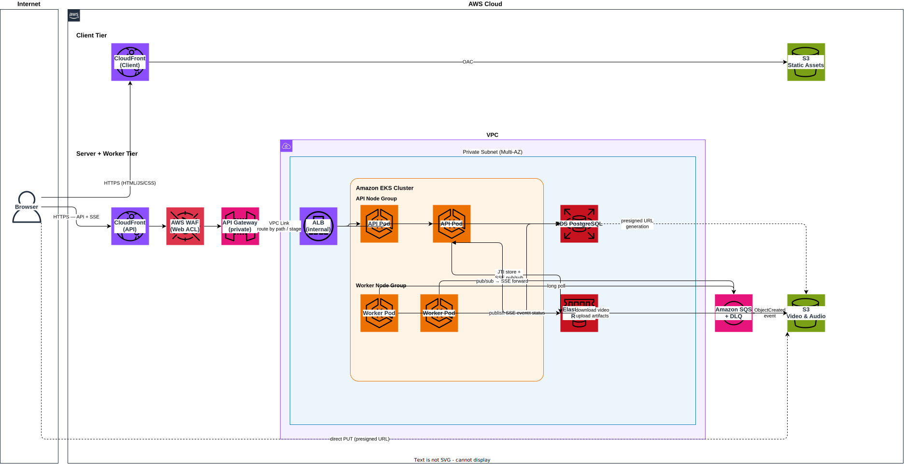

<h1 align="center">Cloud Architecture — AWS</h1>

<p align="center">
  Target AWS deployment topology for the full system: React client, Python API cluster, background workers, and managed data stores.
</p>

---

## Table of Contents

- [Table of Contents](#table-of-contents)
- [Overview](#overview)
- [Client (frontend) tier](#client-frontend-tier)
- [Server (API) tier](#server-api-tier)
- [API Gateway](#api-gateway)
- [Worker tier](#worker-tier)
- [Full network diagram](#full-network-diagram)

---

## Overview

The architecture is split into two independently scalable planes, each with its own dedicated CloudFront distribution as the sole public entry point:

- **Client plane** — a CloudFront distribution serving the static React bundle from S3.
- **Server plane** — a separate CloudFront distribution fronting the private API, with WAF attached as a Web ACL. No backend component (API Gateway, ALB, EKS) has a public IP or listener.

Both planes share the same managed data layer: RDS (Postgres), ElastiCache (Redis), and S3 (object storage).

<p align="left"><a href="#">↑ Back to top</a></p>

---

## Client (frontend) tier

```
Browser
  │  HTTPS
  ▼
CloudFront (Client)  — dedicated distribution for static assets
  │  OAC
  ▼
S3 (static React build — private bucket)
```

- A **dedicated CloudFront distribution** serves the React SPA. It has no connection to the API distribution.
- The S3 bucket is **private**; CloudFront accesses it via an Origin Access Control policy — no public S3 URL exists.
- CloudFront handles TLS, gzip/brotli compression, and edge caching for `*.js`, `*.css`, and image assets.
- A CloudFront Function rewrites all paths to `index.html` to support client-side routing.

<p align="left"><a href="#">↑ Back to top</a></p>

---

## Server (API) tier

```
Browser
  │  HTTPS
  ▼
CloudFront (API)  — dedicated distribution for API + SSE traffic, WAF Web ACL attached
  │
  ▼
API Gateway (private)  ←── reachable only from this CloudFront origin
     │  VPC Link (no public listener)
     ▼
ALB (internal, private subnet)
     │  HTTP/2
     ▼
Amazon EKS — API pods (Deployment)
  ├── Pod 1: uvicorn video_audio_server.main:app
  ├── Pod 2: uvicorn video_audio_server.main:app
  └── Pod N: ...
     │
     ├──── Amazon RDS (PostgreSQL) — private subnet
     ├──── Amazon ElastiCache (Redis) — private subnet
     └──── Amazon S3 — via VPC Endpoint (no public internet)
```

- **Two separate CloudFront distributions** — one for the static client, one for the API. They are fully independent: different domains, different origins, different cache behaviours, and different WAF rules.
- **CloudFront (API)** is the only public entry point for API traffic. No other component in the server tier has a public IP or listener.
- **WAF** is attached to the CloudFront distribution as a Web ACL. It inspects every request (rate limits, OWASP rule groups, geo blocking) before traffic is forwarded to any origin.
- **API Gateway** is a private HTTP API; it accepts traffic only from the CloudFront origin and has no public endpoint of its own. It connects to the ALB via a VPC Link so all traffic stays within the private network.
- **ALB** is internal (no internet-facing listener) and distributes load across EKS pods. No sticky sessions are needed — the API is fully stateless.
- **EKS pods** are horizontally scaled by a Horizontal Pod Autoscaler keyed on CPU and requests-per-second.
- **SSE connections** are long-lived; the ALB idle timeout must be set high enough (e.g. 300 s) to sustain open streams.
- All traffic to RDS, ElastiCache, and S3 stays within the VPC via private subnets and a VPC Endpoint for S3.

<p align="left"><a href="#">↑ Back to top</a></p>

---

## API Gateway

```
CloudFront  (single public entry — WAF Web ACL attached)
     │  API traffic forwarded to private origin
     ▼
API Gateway  (private HTTP API — no public endpoint)
     │  VPC Link
     │  route: /assets/* → assets service
     │  route: /auth/*   → auth service
     │  stage: prod / staging → different ALB targets
     ▼
ALB (internal) → EKS API pods
```

**Why we would want it:**

- **Microservice routing** — as the server grows, `POST /assets` and `GET /auth/me` can be routed to separate EKS deployments (or Lambda functions) based on path prefix. The client calls the same domain; the gateway decides where each request goes.
- **Environment hopping** — stage variables map `prod` and `staging` to different backend targets. A single gateway handles both; promoting to production is a stage alias change, not a DNS update.

<p align="left"><a href="#">↑ Back to top</a></p>

---

## Worker tier

```
Amazon S3
     │  s3:ObjectCreated event notification
     ▼
Amazon SQS (standard queue + dead-letter queue)
     │  long polling
     ▼
Amazon EKS — Worker pods (Deployment)
  ├── Pod 1: arq video_audio_server.worker.WorkerSettings
  ├── Pod 2: arq video_audio_server.worker.WorkerSettings
  └── Pod N: ...
     │
     ├── Download video ──► S3 (via VPC Endpoint)
     ├── Run FFmpeg pipeline (CPU-intensive)
     ├── Upload 4 artifacts ──► S3
     ├── Update asset record ──► RDS
     └── Publish ReadyEvent ──► ElastiCache Redis pub/sub
                                       │
                                       ▼
                               API pod holding SSE connection
                                       │
                                       ▼
                                   Browser client
```

- Workers are **pull-based**: they long-poll SQS and receive a message only when S3 confirms the object is fully written — no client webhook required.
- The SQS **visibility timeout** is set to the maximum expected job duration (e.g. 10 min). If a worker crashes the message reappears and another worker picks it up.
- A **dead-letter queue** captures messages that have failed more than N times so they can be inspected and replayed without blocking the main queue.
- Worker pods are scaled on SQS queue depth via KEDA (Kubernetes Event-Driven Autoscaling) — zero workers when the queue is empty, scale up instantly when jobs arrive.

<p align="left"><a href="#">↑ Back to top</a></p>

---

## Full network diagram



<p align="left"><a href="#">↑ Back to top</a></p>
